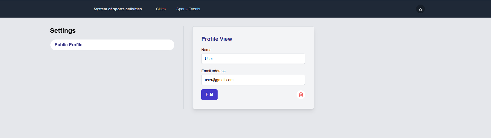
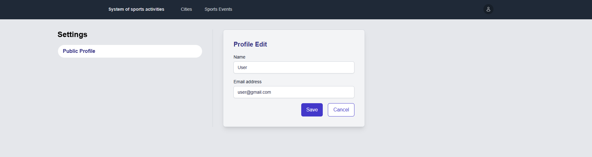

# Sporto veiklu sistema

## 1. Sprendžiamo uždavinio aprašymas

### 1.1. Sistemos paskirtis

Pagrindinis projekto tikslas yra sukurti platformą, kurioje naudotojai gali lengvai surasti sporto veiklas pagal miestą, veiklos tipą ir vietas, bei gauti išsamią informaciją apie šias veiklas. Kiekvienas naudotojas sistemoje turės tam tikrą rolę, kuri nulems jų prieinamą funkcionalumą.

Administratorius privalės prisijungti, kad galėtų naudotis sistemos funkcijomis. Po prisijungimo administratorius gaus pilną prieigą prie sistemos ir galės valdyti visus aspektus, įskaitant sporto veiklų, vietų ir naudotojų administravimą.

Potencialūs klientai (naudotojai) galės naršyti sistemą ir peržiūrėti sporto veiklas pagal miestą, veiklos tipą ar kitus kriterijus (pvz., vidinis/ išorinis sportas, laiko filtrai).
Be registracijos, jie galės matyti pagrindinę informaciją, tačiau norėdami peržiūrėti išsamią informaciją apie veiklos laikus, trenerius ar kainas, jiems reikės prisiregistruoti.
Naudotojai galės peržiūrėti sporto vietos aprašymą, matyti trenerių siūlomas veiklas, įskaitant treniruotes, ir skaityti atsiliepimus apie sporto vietas ar trenerius.
Prisiregistravę naudotojai galės registruotis į veiklas bei palikti atsiliepimus ir reitingus, susijusius su veiklomis ar vietomis.

### 1.2. Funkciniai reikalavimai

Sistemos svečias galės:

-Peržiūrėti sistemoje egzistuojančius miestus ir sporto veiklas;

-Filtruoti sporto veiklas pagal miestą ar kitus kriterijus;

-Matyti trumpą sporto veiklos aprašymą (pvz., sporto tipą, bet ne tikslią vietą ar laiką);

-Registruotis sistemoje norint gauti pilną prieigą.

Registruotas naudotojas galės:

-Prisijungti prie sistemos;

-Matyti išsamią informaciją apie sporto veiklas ir jų vietas;

-Registruotis į sporto veiklas ir renginius;

-Palikti atsiliepimus apie veiklas, vietas;

-Dalyvauti diskusijose ar komentaruose, susijusiuose su sporto veiklomis;

-Atnaujinti savo naudotojo informaciją.

Administratorius galės:

-Prisijungti prie sistemos;

-Pridėti naujas sporto veiklas ir vietas;

-Redaguoti esamas sporto veiklas ir vietas;

-Šalinti nereikalingas sporto veiklas ir vietas;

-Tvarkyti registruotų naudotojų sąrašą, šalinti netinkamus naudotojus;

-Prižiūrėti ir moderuoti naudotojų turinį (atsiliepimus, diskusijas);

-Matyti sistemos statistiką ir valdyti administracines funkcijas.

## 2. Sistemos architektūra

Sistemos sudedamosios dalys:

Kliento pusė – bus realizuota naudojant React.jsx;

Serverio pusė – bus realizuota naudojant PHP Laravel;

Duomenų bazė – MySQL.

Žemiau pavaizduota kuriamos sistemos architektūra pasitelkiant diegimo diagramą.

|  |
| :-----------------------------------------------------------: |
|                    _Sistemos architektūra_                    |

## 3. Naudotojo sąsaja

|  |
| :--------------------------------------------------------: |
|                   _Pagrindinis puslapis_                   |

 

|  |
| :--------------------------------------------------------: |
|                  _Registracijos puslapis_                  |

 

|  |
| :------------------------------------------------------: |
|                 _Prisijungimo puslapis_                  |

 

|  |
| :------------------------------------------------------------------------------------------------: |
|                  _Miestų sąrašo puslapis (naudotojas prisijungęs, arba svečias)_                   |

 

|  |
| :--------------------------------------------------------------------------------------------------------: |
|                  _Miestų sąrašo puslapis (naudotojas prisijungęs kaip administratorius)_                   |

 

|  |
| :----------------------------------------------------------------------------------------------------: |
|                 _Sporto klubų sąrašo puslapiss (naudotojas prisijungęs, arba svečias)_                 |

 

|  |
| :------------------------------------------------------------------------------------------------------------: |
|                 _Sporto klubų sąrašo puslapis (naudotojas prisijungęs kaip administratorius)_                  |

 

|  |
| :----------------------------------------------------------------------------------------------------------------: |
|                   _Sporto klubo trenerių sąrašo puslapis (naudotojas prisijungęs, arba svečias)_                   |

 

|  |
| :------------------------------------------------------------------------------------------------------------------------: |
|                   _Sporto klubo trenerių sąrašo puslapis (naudotojas prisijungęs kaip administratorius)_                   |

 

|  |
| :-------------------------------------------------------------------------------------------------------------------------------------: |
|                     _Sporto renginių sąrašo puslapis (naudotojas prisijungęs kaip administratorius, arba svečias)_                      |

 

|  |
| :-------------------------------------------------------------------------------------------------: |
|                     _Sporto renginių sąrašo puslapis (naudotojas prisijungęs)_                      |

 

|  |
| :-------------------------------------------------------------------------------------------: |
|                   _Prisijungusio naudotojo informacijos peržiūros puslapis_                   |

 

|  |
| :--------------------------------------------------------------------------------------------: |
|                   _Prisijungusio naudotojo informacijos redagavimo puslapis_                   |

 

|  |
| :---------------------------------------------------------------: |
|                    _Paskyros šalinimo modalas_                    |

 

|  |
| :-----------------------------------------------------------------------------------------------------------: |
|                   _Miesto šalinimo modalas (naudotojas prisijungęs kaip administratorius)_                    |

 

|  |
| :----------------------------------------------------------------------------------------------------------: |
|                   _Miesto kūrimo puslapis (naudotojas prisijungęs kaip administratorius)_                    |

 

|  |
| :---------------------------------------------------------------------------------------------------------------: |
|                  _Sporto klubo šalinimo modalas (naudotojas prisijungęs kaip administratorius)_                   |

 

|  |
| :--------------------------------------------------------------------------------------------------------------: |
|                  _Sporto klubo kūrimo puslapis (naudotojas prisijungęs kaip administratorius)_                   |

 

|  |
| :------------------------------------------------------------------------------------------------------------------: |
|                  _Sporto klubo redagavimo puslapis (naudotojas prisijungęs kaip administratorius)_                   |

 

|  |
| :--------------------------------------------------------------------------------------------------------------: |
|                    _Trenerio šalinimo modalas (naudotojas prisijungęs kaip administratorius)_                    |

 

|  |
| :-------------------------------------------------------------------------------------------------------------: |
|                    _Trenerio kūrimo puslapis (naudotojas prisijungęs kaip administratorius)_                    |

 

|  |
| :-----------------------------------------------------------------------------------------------------------------: |
|                    _Trenerio redagavimo puslapis (naudotojas prisijungęs kaip administratorius)_                    |

 

|  |
| :-----------------------------------------------------------------------------------------------------------------------------: |
|                 _Prisiregistruotų naudotojų peržiūros puslapis (naudotojas prisijungęs kaip administratorius)_                  |

 

|  |
| :------------------------------------------------------------------------------------------------------------------------------: |
|                   _Prisiregistruoto naudotojo šalinimo modalas (naudotojas prisijungęs kaip administratorius)_                   |

 

## 4. API specifikacija

-   Atsako formatas: JSON
-   Užklausų kiekis: neribotas

### 4.1 Miestų API metodai

**Gauti miestų sąrašą**

<table> <tr> <td width="500px">API Metodas:</td> <td width="500px">GET</td> </tr> <tr> <td>Paskirtis:</td> <td>Gauti visų miestų sąrašą.</td> </tr> <tr> <td>Pasiekiama adresu:</td> <td>/api/cities</td> </tr> <tr> <td>Užklausos "header" dalis:</td> <td>-</td> </tr> <tr> <td>Užklausos struktūra:</td> <td>-</td> </tr> <tr> <td>Atsakymo struktūra:</td> <td> <code>[ { "id": 1, "name": "New York" }, { "id": 2, "name": "Los Angeles" } ]</code> </td> </tr> <tr> <td>Galimi atsakymo kodai:</td> <td> - 200 (OK): Sėkmingai gautas miestų sąrašas.  - 405 (Metodas neleidžiamas): Nepalaikomas HTTP užklausos metodas. </td> </tr> </table>  
Gauti konkretaus miesto informaciją

<table> <tr> <td width="500px">API Metodas:</td> <td width="500px">GET</td> </tr> <tr> <td>Paskirtis:</td> <td>Gauti konkretaus miesto informaciją pagal jo ID.</td> </tr> <tr> <td>Pasiekiama adresu:</td> <td>/api/cities/{id}</td> </tr> <tr> <td>Užklausos "header" dalis:</td> <td>-</td> </tr> <tr> <td>Užklausos struktūra:</td> <td>-</td> </tr> <tr> <td>Atsakymo struktūra:</td> <td> <code>{ "id": 1, "name": "New York" }</code> </td> </tr> <tr> <td>Galimi atsakymo kodai:</td> <td> - 200 (OK): Sėkmingai gauta miesto informacija.  - 404 (Nerasta): Miestas su nurodytu ID neegzistuoja.  - 405 (Metodas neleidžiamas): Nepalaikomas HTTP užklausos metodas. </td> </tr> </table>  

**Sukurti naują miestą**

<table> <tr> <td width="500px">API Metodas:</td> <td width="500px">POST</td> </tr> <tr> <td>Paskirtis:</td> <td>Sukurti naują miestą.</td> </tr> <tr> <td>Pasiekiama adresu:</td> <td>/api/cities</td> </tr> <tr> <td>Užklausos "header" dalis:</td> <td>Authorization: Bearer {token}</td> </tr> <tr> <td>Užklausos struktūra:</td> <td> <code>{ "name": "San Francisco" }</code> </td> </tr> <tr> <td>Atsakymo struktūra:</td> <td> <code>{ "id": 3, "name": "San Francisco" }</code> </td> </tr> <tr> <td>Galimi atsakymo kodai:</td> <td> - 201 (Sukurta): Miestas sėkmingai sukurtas.  - 401 (Neautorizuotas): Trūksta ar neteisingas prieigos raktas.  - 422 (Nesudėtingas objektas): Netinkami JSON duomenys.  - 405 (Metodas neleidžiamas): Nepalaikomas HTTP užklausos metodas. </td> </tr> </table>  

**Ištrinti miestą**

<table> <tr> <td width="500px">API Metodas:</td> <td width="500px">DELETE</td> </tr> <tr> <td>Paskirtis:</td> <td>Ištrinti esamą miestą pagal jo ID.</td> </tr> <tr> <td>Pasiekiama adresu:</td> <td>/api/cities/{id}</td> </tr> <tr> <td>Užklausos "header" dalis:</td> <td>Authorization: Bearer {token}</td> </tr> <tr> <td>Užklausos struktūra:</td> <td>-</td> </tr> <tr> <td>Atsakymo struktūra:</td> <td>-</td> </tr> <tr> <td>Galimi atsakymo kodai:</td> <td> - 204 (Be turinio): Miestas sėkmingai ištrintas.  - 401 (Neautorizuotas): Trūksta ar neteisingas prieigos raktas.  - 403 (Draudžiama): Vartotojas neturi teisių ištrinti.  - 404 (Nerasta): Miestas su nurodytu ID neegzistuoja.  - 405 (Metodas neleidžiamas): Nepalaikomas HTTP užklausos metodas. </td> </tr> </table>

### 4.2 Sporto salių API metodai

**Gauti sporto salių sąrašą mieste**

<table> <tr> <td width="500px">API metodas:</td> <td width="500px">GET</td> </tr> <tr> <td>Paskirtis:</td> <td>Gauti visų sporto salių konkrečiame mieste sąrašą.</td> </tr> <tr> <td>Prieinama per:</td> <td>/api/cities/{city}/gyms</td> </tr> <tr> <td>Užklausos "header" dalis:</td> <td>-</td> </tr> <tr> <td>Užklausos struktūra:</td> <td>-</td> </tr> <tr> <td>Atsakymo struktūra:</td> <td> <code>[ { "id": 1, "name": "Gold's Gym", "city_id": 1 }, { "id": 2, "name": "Planet Fitness", "city_id": 1 } ]</code> </td> </tr> <tr> <td>Galimi atsakymo kodai:</td> <td> - 200 (OK): Sėkmingai gautas sporto salių sąrašas.  - 404 (Nerasta): Miestas su nurodytu ID neegzistuoja.  - 405 (Metodas neleidžiamas): Nepalaikomas HTTP užklausos metodas. </td> </tr> </table>  

**Gauti konkrečios sporto salės informaciją**

<table> <tr> <td width="500px">API metodas:</td> <td width="500px">GET</td> </tr> <tr> <td>Paskirtis:</td> <td>Gauti informaciją apie konkrečią sporto salę mieste pagal jos ID.</td> </tr> <tr> <td>Prieinama per:</td> <td>/api/cities/{city}/gyms/{gym}</td> </tr> <tr> <td>Užklausos "header" dalis:</td> <td>-</td> </tr> <tr> <td>Užklausos struktūra:</td> <td>-</td> </tr> <tr> <td>Atsakymo struktūra:</td> <td> <code>{ "id": 1, "name": "Gold's Gym", "city_id": 1 }</code> </td> </tr> <tr> <td>Galimi atsakymo kodai:</td> <td> - 200 (OK): Sėkmingai gauta sporto salės informacija.  - 404 (Nerasta): Miestas arba sporto salė su nurodytu ID neegzistuoja, arba sporto salė nepriklauso miestui.  - 405 (Metodas neleidžiamas): Nepalaikomas HTTP užklausos metodas. </td> </tr> </table>  

**Sukurti naują sporto salę mieste**

<table> <tr> <td width="500px">API metodas:</td> <td width="500px">POST</td> </tr> <tr> <td>Paskirtis:</td> <td>Sukurti naują sporto salę nurodytame mieste.</td> </tr> <tr> <td>Prieinama per:</td> <td>/api/cities/{city}/gyms</td> </tr> <tr> <td>Užklausos "header" dalis:</td> <td>Authorization: Bearer {token}</td> </tr> <tr> <td>Užklausos struktūra:</td> <td> <code>{ "name": "Fitness World", "image_url": "https://example.com/image.jpg" }</code> </td> </tr> <tr> <td>Atsakymo struktūra:</td> <td> <code>{ "id": 3, "name": "Fitness World", "city_id": 1 }</code> </td> </tr> <tr> <td>Galimi atsakymo kodai:</td> <td> - 201 (Sukurta): Sėkmingai sukurta sporto salė.  - 401 (Neautorizuotas): Trūksta arba neteisingas token.  - 404 (Nerasta): Miestas su nurodytu ID neegzistuoja.  - 422 (Netinkamas objektas): Pateikti neteisingi JSON duomenys.  - 405 (Metodas neleidžiamas): Nepalaikomas HTTP užklausos metodas. </td> </tr> </table>  

**Atnaujinti esamą sporto salę mieste**

<table> <tr> <td width="500px">API metodas:</td> <td width="500px">PUT</td> </tr> <tr> <td>Paskirtis:</td> <td>Atnaujinti esamos sporto salės informaciją nurodytame mieste.</td> </tr> <tr> <td>Prieinama per:</td> <td>/api/cities/{city}/gyms/{gym}</td> </tr> <tr> <td>Užklausos "header" dalis:</td> <td>Authorization: Bearer {token}</td> </tr> <tr> <td>Užklausos struktūra:</td> <td> <code>{ "name": "Updated Gym Name", "image_url": "https://example.com/new-image.jpg" }</code> </td> </tr> <tr> <td>Atsakymo struktūra:</td> <td> <code>{ "id": 1, "name": "Updated Gym Name", "city_id": 1 }</code> </td> </tr> <tr> <td>Galimi atsakymo kodai:</td> <td> - 200 (OK): Sėkmingai atnaujinta sporto salė.  - 401 (Neautorizuotas): Trūksta arba neteisingas token.  - 404 (Nerasta): Miestas arba sporto salė su nurodytu ID neegzistuoja, arba sporto salė nepriklauso miestui.  - 422 (Netinkamas objektas): Pateikti neteisingi JSON duomenys.  - 405 (Metodas neleidžiamas): Nepalaikomas HTTP užklausos metodas. </td> </tr> </table>  

**Ištrinti sporto salę mieste**

<table> <tr> <td width="500px">API metodas:</td> <td width="500px">DELETE</td> </tr> <tr> <td>Paskirtis:</td> <td>Ištrinti esamą sporto salę nurodytame mieste.</td> </tr> <tr> <td>Prieinama per:</td> <td>/api/cities/{city}/gyms/{gym}</td> </tr> <tr> <td>Užklausos "header" dalis:</td> <td>Authorization: Bearer {token}</td> </tr> <tr> <td>Užklausos struktūra:</td> <td>-</td> </tr> <tr> <td>Atsakymo struktūra:</td> <td>-</td> </tr> <tr> <td>Galimi atsakymo kodai:</td> <td> - 204 (Nėra turinio): Sėkmingai ištrinta sporto salė.  - 401 (Neautorizuotas): Trūksta arba neteisingas token.  - 404 (Nerasta): Miestas arba sporto salė su nurodytu ID neegzistuoja, arba sporto salė nepriklauso miestui.  </td> </tr> </table>

### 4.3 Sporto trenerių API metodai

**Gauti trenerių sąrašą konkrečiame miesto sporto klube**

<table> <tr> <td width="500px">API metodas:</td> <td width="500px">GET</td> </tr> <tr> <td>Paskirtis:</td> <td>Gauti trenerių, susijusių su konkrečiu sporto klubu mieste, sąrašą.</td> </tr> <tr> <td>Pasiekiama adresu:</td> <td>/api/cities/{cityId}/gyms/{gymId}/coaches</td> </tr> <tr> <td>Užklausos "header" dalis:</td> <td>-</td> </tr> <tr> <td>Užklausos struktūra:</td> <td>-</td> </tr> <tr> <td>Atsakymo struktūra:</td> <td> <code>[ { "id": 1, "name": "John Doe", "specialty": "Personal Training" }, { "id": 2, "name": "Jane Smith", "specialty": "Yoga" } ]</code> </td> </tr> <tr> <td>Galimi atsakymo kodai:</td> <td> - 200 (OK): Sėkmingai gautas trenerių sąrašas.  - 404 (Nerasta): Miestas arba sporto klubas nerastas.  </td> </tr> </table>  

**Gauti konkretaus trenerio informaciją**

<table> <tr> <td width="500px">API metodas:</td> <td width="500px">GET</td> </tr> <tr> <td>Paskirtis:</td> <td>Gauti konkretaus sporto klubo trenerio mieste informaciją.</td> </tr> <tr> <td>Pasiekiama adresu:</td> <td>/api/cities/{cityId}/gyms/{gymId}/coaches/{coachId}</td> </tr> <tr> <td>Užklausos "header" dalis:</td> <td>-</td> </tr> <tr> <td>Užklausos struktūra:</td> <td>-</td> </tr> <tr> <td>Atsakymo struktūra:</td> <td> <code>{ "id": 1, "name": "John Doe", "specialty": "Personal Training" }</code> </td> </tr> <tr> <td>Galimi atsakymo kodai:</td> <td> - 200 (OK): Sėkmingai gauta trenerio informacija.  - 404 (Nerasta): Miestas, sporto klubas arba treneris nerastas.  </td> </tr> </table>  

**Sukurti naują trenerį**

<table> <tr> <td width="500px">API metodas:</td> <td width="500px">POST</td> </tr> <tr> <td>Paskirtis:</td> <td>Sukurti naują trenerį sporto klube konkrečiame mieste.</td> </tr> <tr> <td>Pasiekiama adresu:</td> <td>/api/cities/{cityId}/gyms/{gymId}/coaches</td> </tr> <tr> <td>Užklausos "header" dalis:</td> <td>Authorization: Bearer {token}</td> </tr> <tr> <td>Užklausos struktūra:</td> <td> <code>{ "name": "Alice Johnson", "specialty": "Zumba"}</code> </td> </tr> <tr> <td>Atsakymo struktūra:</td> <td> <code>{ "id": 3, "name": "Alice Johnson", "specialty": "Zumba"}</code> </td> </tr> <tr> <td>Galimi atsakymo kodai:</td> <td> - 201 (Sukurta): Treneris sėkmingai sukurtas.  - 401 (Neautorizuota): Trūksta arba neteisingas tokenas.  - 404 (Nerasta): Miestas arba sporto klubas nerastas.  - 422 (Netinkamas objektas): Pateikti netinkami duomenys.  </td> </tr> </table>  

**Atnaujinti esamą trenerį**

<table> <tr> <td width="500px">API metodas:</td> <td width="500px">PUT</td> </tr> <tr> <td>Paskirtis:</td> <td>Atnaujinti esamo trenerio duomenis sporto klube mieste.</td> </tr> <tr> <td>Pasiekiama adresu:</td> <td>/api/cities/{cityId}/gyms/{gymId}/coaches/{coachId}</td> </tr> <tr> <td>Užklausos "header" dalis:</td> <td>Authorization: Bearer {token}</td> </tr> <tr> <td>Užklausos struktūra:</td> <td> <code>{ "name": "Alice Johnson", "specialty": "Pilates" }</code> </td> </tr> <tr> <td>Atsakymo struktūra:</td> <td> <code>{ "id": 3, "name": "Alice Johnson", "specialty": "Pilates" }</code> </td> </tr> <tr> <td>Galimi atsakymo kodai:</td> <td> - 200 (OK): Treneris sėkmingai atnaujintas.  - 401 (Neautorizuota): Trūksta arba neteisingas tokenas.  - 404 (Nerasta): Miestas, sporto klubas arba treneris nerastas.  - 422 (Netinkamas objektas): Pateikti netinkami duomenys.  </td> </tr> </table>  

**Ištrinti trenerį**

<table> <tr> <td width="500px">API metodas:</td> <td width="500px">DELETE</td> </tr> <tr> <td>Paskirtis:</td> <td>Ištrinti trenerį iš sporto klubo mieste.</td> </tr> <tr> <td>Pasiekiama adresu:</td> <td>/api/cities/{cityId}/gyms/{gymId}/coaches/{coachId}</td> </tr> <tr> <td>Užklausos "header" dalis:</td> <td>Authorization: Bearer {token}</td> </tr> <tr> <td>Užklausos struktūra:</td> <td>-</td> </tr> <tr> <td>Atsakymo struktūra:</td> <td>-</td> </tr> <tr> <td>Galimi atsakymo kodai:</td> <td> - 204 (Be turinio): Treneris sėkmingai ištrintas.  - 401 (Neautorizuota): Trūksta arba neteisingas tokenas.  - 404 (Nerasta): Miestas, sporto klubas arba treneris nerastas.  </td> </tr> </table>  

### 4.4 Vartotojų API metodai

**Gauti visų vartotojų sąrašą**

<table> <tr> <td width="500px">API metodas:</td> <td width="500px">GET</td> </tr> <tr> <td>Paskirtis:</td> <td>Gauti visų sistemos vartotojų sąrašą.</td> </tr> <tr> <td>Pasiekiama adresu:</td> <td>/api/users</td> </tr> <tr> <td>Užklausos "header" dalis:</td> <td>Authorization: Bearer {token}</td> </tr> <tr> <td>Užklausos struktūra:</td> <td>-</td> </tr> <tr> <td>Atsakymo struktūra:</td> <td> <code>[ { "id": 1, "name": "John Doe", "email": "john@example.com" }, { "id": 2, "name": "Jane Smith", "email": "jane@example.com" } ]</code> </td> </tr> <tr> <td>Galimi atsakymo kodai:</td> <td> - 200 (OK): Sėkmingai gautas vartotojų sąrašas.  - 401 (Neautorizuota): Trūksta arba neteisingas tokenas.  </td> </tr> </table>  

**Gauti konkretaus vartotojo informaciją**

<table> <tr> <td width="500px">API metodas:</td> <td width="500px">GET</td> </tr> <tr> <td>Paskirtis:</td> <td>Gauti konkretaus vartotojo informaciją pagal jo ID.</td> </tr> <tr> <td>Pasiekiama adresu:</td> <td>/api/users/{id}</td> </tr> <tr> <td>Užklausos "header" dalis:</td> <td>Authorization: Bearer {token}</td> </tr> <tr> <td>Užklausos struktūra:</td> <td>-</td> </tr> <tr> <td>Atsakymo struktūra:</td> <td> <code>{ "id": 1, "name": "John Doe", "email": "john@example.com" }</code> </td> </tr> <tr> <td>Galimi atsakymo kodai:</td> <td> - 200 (OK): Sėkmingai gauta vartotojo informacija.  - 404 (Nerasta): Vartotojas nerastas.  </td> </tr> </table>  

**Gauti prisijungusio vartotojo informaciją**

<table> <tr> <td width="500px">API metodas:</td> <td width="500px">GET</td> </tr> <tr> <td>Paskirtis:</td> <td>Gauti dabartinio prisijungusio vartotojo informaciją.</td> </tr> <tr> <td>Pasiekiama adresu:</td> <td>/api/user</td> </tr> <tr> <td>Užklausos "header" dalis:</td> <td>Authorization: Bearer {token}</td> </tr> <tr> <td>Užklausos struktūra:</td> <td>-</td> </tr> <tr> <td>Atsakymo struktūra:</td> <td> <code>{ "id": 1, "name": "John Doe", "email": "john@example.com" }</code> </td> </tr> <tr> <td>Galimi atsakymo kodai:</td> <td> - 200 (OK): Sėkmingai gauta prisijungusio vartotojo informacija.  - 401 (Neautorizuota): Trūksta arba neteisingas tokenas.  </td> </tr> </table>  

**Atnaujinti vartotojo informaciją**

<table> <tr> <td width="500px">API metodas:</td> <td width="500px">PATCH</td> </tr> <tr> <td>Paskirtis:</td> <td>Atnaujinti konkretaus vartotojo informaciją pagal jo ID.</td> </tr> <tr> <td>Pasiekiama adresu:</td> <td>/api/users/{userId}</td> </tr> <tr> <td>Užklausos "header" dalis:</td> <td>Authorization: Bearer {token}</td> </tr> <tr> <td>Užklausos struktūra:</td> <td> <code>{ "name": "John Doe", "email": "john.doe@example.com", "password": "newpassword123" }</code> </td> </tr> <tr> <td>Atsakymo struktūra:</td> <td> <code>{ "id": 1, "name": "John Doe", "email": "john.doe@example.com" }</code> </td> </tr> <tr> <td>Galimi atsakymo kodai:</td> <td> - 200 (OK): Sėkmingai atnaujintas vartotojas.  - 422 (Netinkamas objektas): Pateikti netinkami duomenys.  - 404 (Nerasta): Vartotojas nerastas.  </td> </tr> </table>  

**Ištrinti vartotoją**

<table> <tr> <td width="500px">API metodas:</td> <td width="500px">DELETE</td> </tr> <tr> <td>Paskirtis:</td> <td>Ištrinti vartotoją iš sistemos.</td> </tr> <tr> <td>Pasiekiama adresu:</td> <td>/api/users/{userId}</td> </tr> <tr> <td>Užklausos "header" dalis:</td> <td>Authorization: Bearer {token}</td> </tr> <tr> <td>Užklausos struktūra:</td> <td>-</td> </tr> <tr> <td>Atsakymo struktūra:</td> <td>-</td> </tr> <tr> <td>Galimi atsakymo kodai:</td> <td> - 204 (Be turinio): Sėkmingai ištrintas vartotojas.  - 404 (Nerasta): Vartotojas nerastas.  </td> </tr> </table>  

### 4.5 Autentifikavimo API metodai

**Vartotojo registracija**

<table> <tr> <td width="500px">API metodas:</td> <td width="500px">POST</td> </tr> <tr> <td>Paskirtis:</td> <td>Sukurti naują vartotojo paskyrą.</td> </tr> <tr> <td>Pasiekiama adresu:</td> <td>/api/signup</td> </tr> <tr> <td>Užklausos "header" dalis:</td> <td>-</td> </tr> <tr> <td>Užklausos struktūra:</td> <td> <code>{ "name": "John Doe", "email": "john@example.com", "password": "Password123-", "password_confirmation": "Password123-" }</code> </td> </tr> <tr> <td>Atsakymo struktūra:</td> <td> <code>{ "message": "Signup successful!", "user": { "id": 1, "name": "John Doe", "email": "john@example.com" } }</code> </td> </tr> <tr> <td>Galimi atsakymo kodai:</td> <td> - 201 (Sukurta): Registracija sėkminga.  - 400 (Neteisinga užklausa): Klaida, pvz., trūksta arba pateikti netinkami duomenys.  </td> </tr> </table>  

**Vartotojo prisijungimas**

<table> <tr> <td width="500px">API metodas:</td> <td width="500px">POST</td> </tr> <tr> <td>Paskirtis:</td> <td>Autentifikuoti vartotoją ir sugeneruoti prieigos bei atnaujinimo tokenus.</td> </tr> <tr> <td>Pasiekiama adresu:</td> <td>/api/login</td> </tr> <tr> <td>Užklausos "header" dalis:</td> <td>-</td> </tr> <tr> <td>Užklausos struktūra:</td> <td> <code>{ "email": "john@example.com", "password": "Password123-" }</code> </td> </tr> <tr> <td>Atsakymo struktūra:</td> <td> <code>{ "success": true, "message": "Login successful", "accessToken": "access_token_value", "refreshToken": "refresh_token_value", "tokenType": "bearer", "accessExpiresIn": 3600, "refreshExpiresIn": 86400 }</code> </td> </tr> <tr> <td>Galimi atsakymo kodai:</td> <td> - 200 (OK): Prisijungta sėkmingai.  - 401 (Neautorizuota): Neteisingi prisijungimo duomenys.  </td> </tr> </table>  

**Tokeno atnaujinimas**

<table> <tr> <td width="500px">API metodas:</td> <td width="500px">POST</td> </tr> <tr> <td>Paskirtis:</td> <td>Atnaujinti prieigos tokeną naudojant galiojantį atnaujinimo tokeną.</td> </tr> <tr> <td>Pasiekiama adresu:</td> <td>/api/refresh-token</td> </tr> <tr> <td>Užklausos "header" dalis:</td> <td>-</td> </tr> <tr> <td>Užklausos struktūra:</td> <td> <code>{ "refreshToken": "refresh_token_value" }</code> </td> </tr> <tr> <td>Atsakymo struktūra:</td> <td> <code>{ "message": "Token successfully refreshed", "accessToken": "new_access_token_value", "tokenType": "bearer", "expiresIn": 3600 }</code> </td> </tr> <tr> <td>Galimi atsakymo kodai:</td> <td> - 200 (OK): Tokenas sėkmingai atnaujintas.  - 400 (Neteisinga užklausa): Trūksta atnaujinimo tokeno.  - 401 (Neautorizuota): Neteisingas arba pasibaigusio galiojimo atnaujinimo tokenas.  - 500 (Vidinė serverio klaida): Klaida atnaujinant tokeną.  </td> </tr> </table>  

**Vartotojo atsijungimas**

<table> <tr> <td width="500px">API metodas:</td> <td width="500px">POST</td> </tr> <tr> <td>Paskirtis:</td> <td>Atsijungti vartotojui, išjungiant prieigos tokeną.</td> </tr> <tr> <td>Pasiekiama adresu:</td> <td>/api/logout</td> </tr> <tr> <td>Užklausos "header" dalis:</td> <td>Authorization: Bearer {token}</td> </tr> <tr> <td>Užklausos struktūra:</td> <td>-</td> </tr> <tr> <td>Atsakymo struktūra:</td> <td> <code>{ "message": "Successfully logged out" }</code> </td> </tr> <tr> <td>Galimi atsakymo kodai:</td> <td> - 200 (OK): Atsijungta sėkmingai.  - 401 (Neautorizuota): Trūksta arba neteisingas tokenas.  </td> </tr> </table>  

### 4.5 Sporto renginių API metodai

**Gauti visus sporto renginius**

<table> <tr> <td width="500px">API metodas:</td> <td width="500px">GET</td> </tr> <tr> <td>Paskirtis:</td> <td>Gauti puslapiuotą visų sporto renginių sąrašą.</td> </tr> <tr> <td>Pasiekiama adresu:</td> <td>/api/sports-events</td> </tr> <tr> <td>Užklausos "header" dalis:</td> <td>-</td> </tr> <tr> <td>Užklausos struktūra:</td> <td>-</td> </tr> <tr> <td>Atsakymo struktūra:</td> <td> <code>{ "data": [ { "id": 1, "name": "Football Match", "description": "An exciting match", "location": "Stadium A", "entry_fee": 10, "is_free": false, "start_date": "2024-12-20T10:00:00", "end_date": "2024-12-20T12:00:00", "max_participants": 100, "current_participants": 50, "users": [ ... ] } ], "links": { ... }, "meta": { ... } }</code> </td> </tr> <tr> <td>Galimi atsakymo kodai:</td> <td> - 200 (OK): Sėkmingai gauti sporto renginių sąrašas.  </td> </tr> </table>  

**Prisijungti prie sporto renginio**

<table> <tr> <td width="500px">API metodas:</td> <td width="500px">POST</td> </tr> <tr> <td>Paskirtis:</td> <td>Prisijungti prie konkretaus sporto renginio.</td> </tr> <tr> <td>Pasiekiama adresu:</td> <td>/api/sports-events/{id}/join</td> </tr> <tr> <td>Užklausos "header" dalis:</td> <td>Authorization: Bearer {token}</td> </tr> <tr> <td>Užklausos struktūra:</td> <td>-</td> </tr> <tr> <td>Atsakymo struktūra:</td> <td> <code>{ "message": "You have successfully joined the event.", "event": { "id": 1, "name": "Football Match", "description": "An exciting match", "location": "Stadium A", "entry_fee": 10, "is_free": false, "start_date": "2024-12-20T10:00:00", "end_date": "2024-12-20T12:00:00", "max_participants": 100, "current_participants": 51, "users": [ ... ] } }</code> </td> </tr> <tr> <td>Galimi atsakymo kodai:</td> <td> - 200 (OK): Sėkmingai prisijungta prie renginio.  - 400 (Bloga užklausa): Renginys jau pilnas arba kitos problemos.  </td> </tr> </table>  

**Palikti sporto renginį**

<table> <tr> <td width="500px">API metodas:</td> <td width="500px">POST</td> </tr> <tr> <td>Paskirtis:</td> <td>Palikti konkretų sporto renginį.</td> </tr> <tr> <td>Pasiekiama adresu:</td> <td>/api/sports-events/{id}/leave</td> </tr> <tr> <td>Užklausos "header" dalis:</td> <td>Authorization: Bearer {token}</td> </tr> <tr> <td>Užklausos struktūra:</td> <td>-</td> </tr> <tr> <td>Atsakymo struktūra:</td> <td> <code>{ "message": "You have successfully left the event.", "event": { "id": 1, "name": "Football Match", "description": "An exciting match", "location": "Stadium A", "entry_fee": 10, "is_free": false, "start_date": "2024-12-20T10:00:00", "end_date": "2024-12-20T12:00:00", "max_participants": 100, "current_participants": 49, "users": [ ... ] } }</code> </td> </tr> <tr> <td>Galimi atsakymo kodai:</td> <td> - 200 (OK): Sėkmingai paliktas renginys.  - 400 (Bloga užklausa): Nepavyko palikti renginio.  </td> </tr> </table>  

### 4.5 Slaptažodžio atstatymo API metodai

**Siųsti slaptažodžio atstatymo nuorodą**

<table> <tr> <td width="500px">API metodas:</td> <td width="500px">POST</td> </tr> <tr> <td>Paskirtis:</td> <td>Išsiųsti slaptažodžio atstatymo nuorodą naudotojo el. pašto adresu.</td> </tr> <tr> <td>Pasiekiama adresu:</td> <td>/api/password/email</td> </tr> <tr> <td>Užklausos "header" dalis:</td> <td>-</td> </tr> <tr> <td>Užklausos struktūra:</td> <td> <code>{ "email": "user@example.com" }</code> </td> </tr> <tr> <td>Atsakymo struktūra:</td> <td> <code>{ "message": "Slaptažodžio atstatymo nuoroda sėkmingai išsiųsta" }</code> </td> </tr> <tr> <td>Galimi atsakymo kodai:</td> <td> - 200 (OK): Slaptažodžio atstatymo nuoroda sėkmingai išsiųsta.  - 400 (Bloga užklausa): Klaidingas arba nenurodytas el. pašto adresas.  </td> </tr> </table>  

**Atstatyti slaptažodį**

<table> <tr> <td width="500px">API metodas:</td> <td width="500px">POST</td> </tr> <tr> <td>Paskirtis:</td> <td>Atstatyti naudotojo slaptažodį, naudojant galiojantį token'ą ir el. paštą.</td> </tr> <tr> <td>Pasiekiama adresu:</td> <td>/api/password/reset</td> </tr> <tr> <td>Užklausos "header" dalis:</td> <td>-</td> </tr> <tr> <td>Užklausos struktūra:</td> <td> <code>{ "token": "reset_token", "email": "user@example.com", "password": "newpassword", "password_confirmation": "newpassword" }</code> </td> </tr> <tr> <td>Atsakymo struktūra:</td> <td> <code>{ "message": "Slaptažodis sėkmingai atstatytas" }</code> </td> </tr> <tr> <td>Galimi atsakymo kodai:</td> <td> - 200 (OK): Slaptažodis sėkmingai atstatytas.  - 400 (Bloga užklausa): Klaidingas arba pasibaigęs token'as.  - 404 (Nerasta): Naudotojas nerastas.  </td> </tr> </table>  
